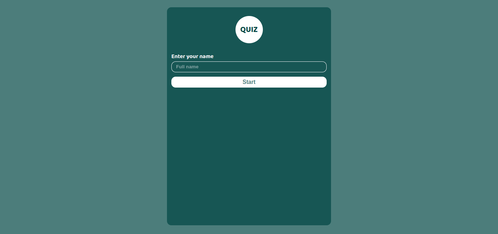
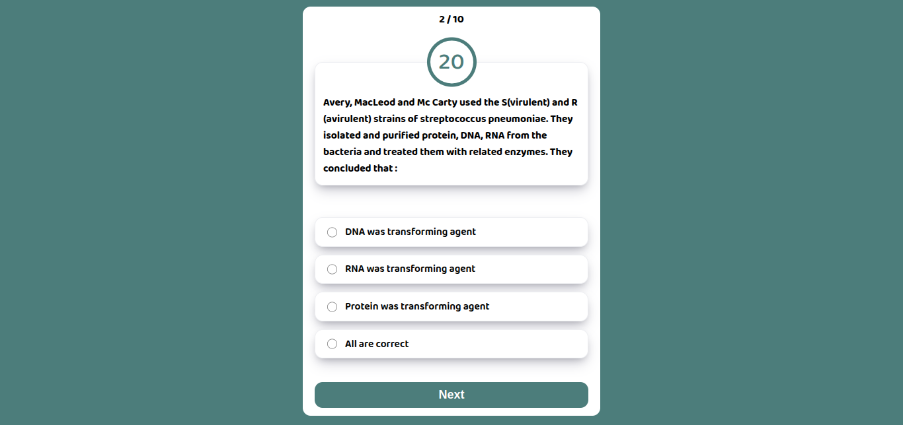
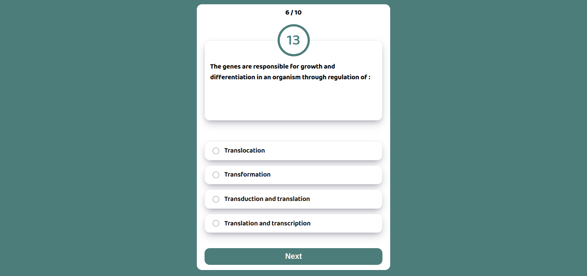
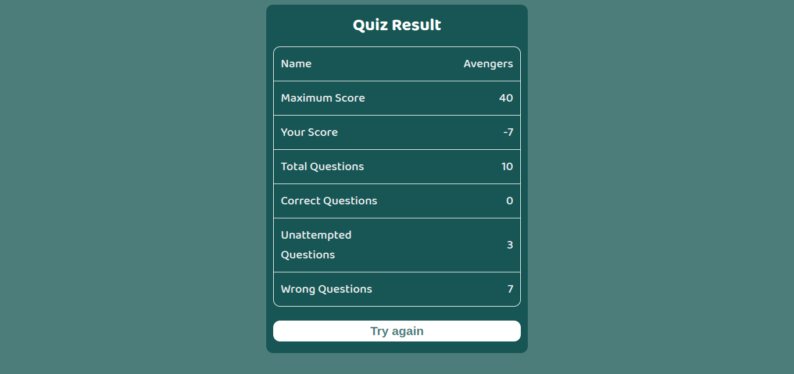

# Test App

A Quiz Web application built using React Js.

## Table of contents

1. [Introduction](#introduction)
2. [Technologies used](#technologie-used)
3. [Setup](#setup)
4. [Video](#video)

## Introduction

The Quiz app is built using React Js. React js is the popular frontend library used to make dynamic web apps.

The project uses functional components, hooks like useState, useEffect.

## 🚀 Technologies used

1. Quiz app is built using React Js.

## ⚙️ Setup

### Installation

1. Clone this repository:
   `git clone https://github.com/premdood/test-app.git`
2. Navigate to the project directory:
   `cd test-app`
3. Install the dependencies:
   `npm install`

### Usage

- Run the project with the following command:
  `npm run dev`
- Access it with the browser at:
  `https://localhost:5173`

## 📸 Screenshots

## ▶️ Video

<video src='https://github.com/user-attachments/assets/0ff859bb-3e55-4dd6-8df0-67f83c13e194'></video>